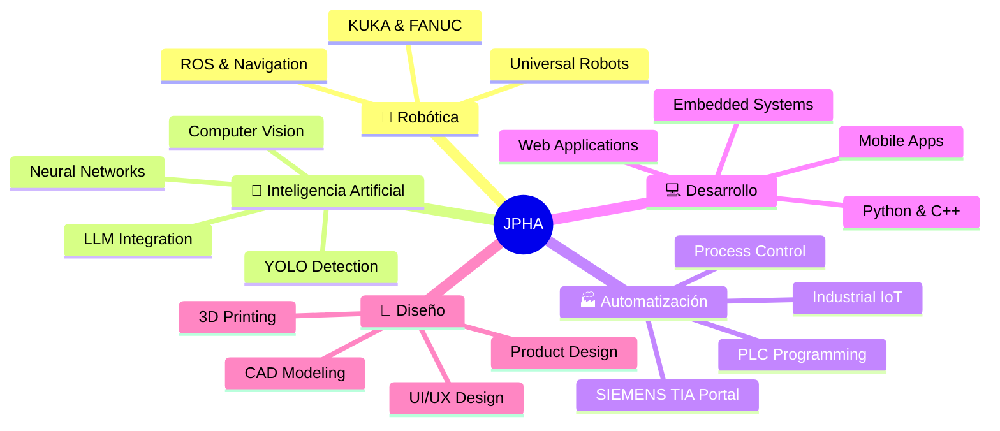

<div align="center">
  
# 🚀 José Pablo Hernández Alonso
### 💻 `TECH DRIVEN, HEART INSPIRED` 💡


[](https://jphajp.github.io/JPHAJP/)
[](https://www.linkedin.com/in/jphajp/)
[](mailto:josepabloservicio@outlook.com)


</div>

---

## 🎯 **Sobre Mí**

> **Ingeniero Mecatrónico** 🤖 | **Especialista en IA & Robótica** 🧠 | **Innovador Tecnológico** ⚡

```yaml
Perfil:
  Nombre: "José Pablo Hernández Alonso"
  Rol: "Ingeniero Mecatrónico | Desarrollador IA"
  Educación: "Ibero Puebla - 10mo Semestre"
  Empresa: "Sistema ALARO"
  Ubicación: "Puebla, México 🇲🇽"
  
Especialidades:
  - Robótica Industrial (Universal Robots, KUKA, FANUC)
  - Inteligencia Artificial & Computer Vision
  - Automatización Industrial (PLC SIEMENS)
  - Internet of Things (IoT)
  - Desarrollo Web & Apps
  
Filosofía: "Combinando ingeniería de precisión con creatividad e innovación"
```

---

## 🛠️ **Stack Tecnológico**

<div align="center">

### 🚀 **Lenguajes & Frameworks**


### 🤖 **IA & Machine Learning**


### 🏭 **Industrial & Robotics**


### 🖥️ **Hardware & MCUs**


### 🎨 **Diseño & CAD**


</div>

---

## 🏆 **Proyectos Destacados**

<div align="center">

### 🌟 **Proyectos Principales**

<table>
<tr>
<td width="50%">

#### 🚀 [NASA Space Apps Challenge 2024](https://github.com/DavidBo9/Nasa-Challenge2)
> **Desafío Global de Innovación Espacial**
- 🛰️ **Tech Stack:** Python, IA, React, Node.js, Three.js
- 🌍 **Objetivo:** Resolver problemas espaciales y climáticos
- 🏅 **Logro:** Participación en competencia internacional

</td>
<td width="50%">

#### 🏥 [UR5 SRUB NURSE - Robotic AI](https://ieeexplore.ieee.org/document/10765997)
> **Sistema Robótico Inteligente para Salud**
- 🤖 **Tech Stack:** C++, Python, YOLO, UrScript, LLM
- 🎯 **Objetivo:** Automatización en sector médico
- 📄 **Publicación:** IEEE Paper oficial

</td>
</tr>
<tr>
<td width="50%">

#### 🔧 [Automatización Industrial](https://jphajp.github.io/automatizacion/)
> **Sistemas de Control Avanzados**
- ⚙️ **Tech Stack:** PLC SIEMENS, TIA Portal, IoT
- 🏭 **Objetivo:** Optimización de procesos industriales
- 🎮 **Demo:** Interfaz web interactiva

</td>
<td width="50%">

#### 🍞 [Panadería Inteligente](https://github.com/JPHAJP/Raspberry)
> **Sistema de Visión por Computadora**
- 👁️ **Tech Stack:** YOLO, OpenCV, Raspberry Pi, Firebase
- 🧠 **Objetivo:** Automatización con IA visual
- 📱 **UI:** QT5, Tkinter, MySQL

</td>
</tr>
</table>

### 🎮 **Proyectos de Innovación**

| Proyecto | Tecnología | Descripción |
|----------|------------|-------------|
| **🎯 FPGA Atari Breakout** | `Verilog` `FPGA` `VHDL` | Videojuego en hardware descriptivo |
| **🧠 EmoHelper AI** | `OpenAI` `Gradio` `Llama3.1` | Generador de poemas con IA |
| **🎨 StableDiffusion + UR5** | `StableDiffusion` `Python` `UrScript` | Arte robótico con IA generativa |
| **📡 Redes Digitales IoT** | `ESP32` `Firebase` `WebApp` | Dashboard IoT en tiempo real |

</div>

---

## 📊 **GitHub Analytics**

<div align="center">
  


</div>

---

## 🏅 **Logros & Reconocimientos**

<div align="center">

| 🏆 Evento | 📅 Año | 🎯 Logro |
|-----------|---------|----------|
| **IEEE Publication** | 2024 | 📄 Paper oficial sobre robótica médica |
| **NASA Space Apps Challenge** | 2024 | 🚀 Participación internacional |
| **CONITACS XIV** | 2024 | 🏥 Presentación en congreso nacional |
| **ExpoIBERO** | 2021-2024 | 🎓 Múltiples exhibiciones universitarias |
| **CSWP Certification** | 2023 | 📜 SolidWorks Professional |

</div>

---

## 🎯 **Áreas de Especialización**

<div align="center">



</div>

---

## 🌐 **Conectemos**

<div align="center">

### 💬 **¡Colaboremos en proyectos increíbles!**

[](https://jphajp.github.io/JPHAJP/)
[](https://www.linkedin.com/in/jphajp/)
[](https://github.com/JPHAJP)
[](mailto:josepabloservicio@outlook.com)
[](https://www.instagram.com/jose_pablo_ha)
[](https://discord.com/users/jphajp)

### 🚀 **¿Interesado en colaborar?**
> Siempre abierto a proyectos de **IA**, **Robótica**, **IoT** y **Automatización Industrial**

</div>

---

<div align="center">

### ⚡ **"Donde la ingeniería se encuentra con la creatividad"** ⚡


</div>