<div align="center">

  <!-- Translation Button -->
  <a href="https://translate.google.com/translate?sl=en&tl=es&u=https://github.com/JPHAJP/JPHAJP">
    
  </a>

  <br/><br/>

  <!-- Name Animation (Full Name in One Line) -->
  <a href="https://git.io/typing-svg">
    
  </a>

  <br/>

  <!-- Profile Image -->
  

  <br/><br/>

  <!-- Roles Animation -->
  <a href="https://git.io/typing-svg">
    
  </a>

  <p align="center">
    <samp style="color: #b3b3b3; font-weight: bold; letter-spacing: 2px;"> >_ TECH DRIVEN, HEART INSPIRED</samp>
  </p>

  <br/>

  <!-- Social Badges -->
  [](https://jphajp.github.io/JPHAJP/)
  [](https://www.linkedin.com/in/jphajp/)
  [](mailto:contacto@jphajp.com)
  [](https://discord.com/users/jphajp)

  

</div>

<br/>

## 🆔 **System Identity**

```yaml
# USER_PROFILE_LOADED_SUCCESSFULLY
# ACCESS_LEVEL: ADMIN

IDENTITY:
  Name:       "José Pablo Hernández Alonso"
  Archetype:  "Mechatronics Engineer | AI Developer"
  Location:   "Puebla, México 🇲🇽"
  Affiliation: "Sistema ALARO"
  
STATS:
  Education:  "Ibero Puebla (GRADUATED WITH HONORS) 🎓"
  GPA:        "HIGHEST GRADUATING AVERAGE - 4.0"
  Awards:     "Academic Honors | CENEVAL Medal | ANFEI Recognition | CSWP | IEEE Publication | NASA Space Apps"
  Status:     "PROFESSIONAL 🟢"
  Mission:    "Combining precision engineering with creative innovation"

SKILL_TREE:
  - [x] Robotics & Automation
  - [x] Computer Vision & AI
  - [x] Industrial IoT
```

<br/>

## 🛠️ **Tech Arsenal**

<div align="center">

### 🚀 **Languages & Frameworks**


### 🤖 **AI & Machine Learning**


### 🏭 **Industrial & Robotics**


### 🖥️ **Hardware & IoT**


### 🎨 **Design & CAD**


### 🗄️ **Databases & Cloud**


</div>

## 🌍 **Languages**

<div align="center">

| Language | Level | Proficiency |
|:---------|:-----:|:------------|
|  **Spanish** | `NATIVE` |  |
|  **English** | `C1` |  |
|  **German** | `B1` |  |

<br/>

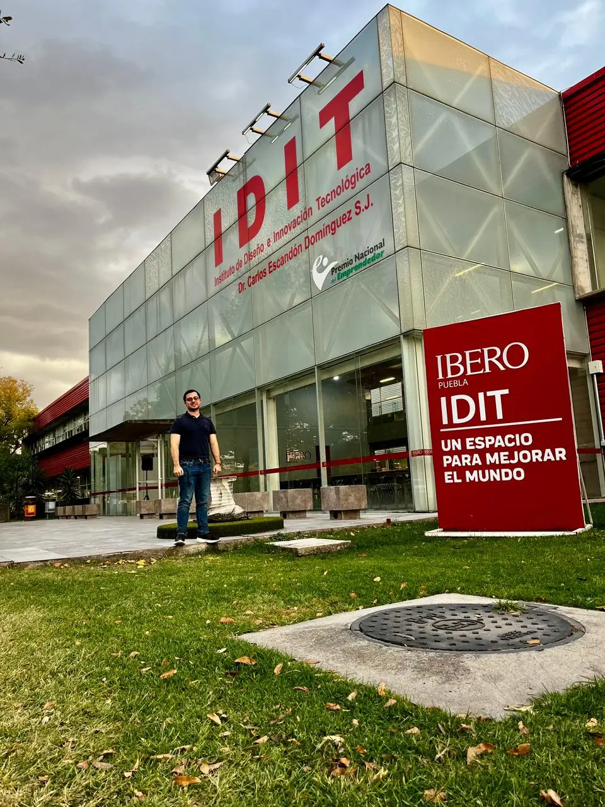

<br/><br/>

```ascii
╔═══════════════════════════════════════════════════════╗
║  🌐 MULTILINGUAL PROFESSIONAL                        ║
║  • Spanish:  ████████████████████████  Native        ║
║  • English:  ████████████████████░░░  C1 Advanced    ║
║  • German:   ████████████░░░░░░░░░░  B1 Intermediate ║
╚═══════════════════════════════════════════════════════╝
```

</div>

<br/>

## 🚀 **Mission Log (Featured Projects)**

<div align="center">

### 🌟 **Flagship Projects**

<table>
<tr>
<td width="50%" align="center">
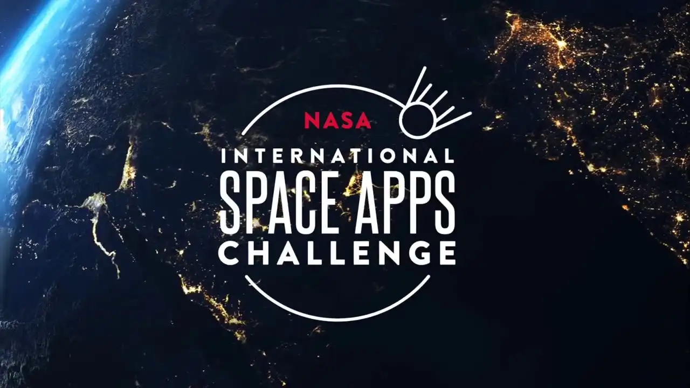

#### 🛸 [NASA Space Apps Challenge 2024](https://github.com/DavidBo9/Nasa-Challenge2)
`Python` `AI` `React` `Node.js` `Three.js`<br/>
🌍 Space and climate challenge innovation<br/>
🏆 International Competition Participant
</td>
<td width="50%" align="center">
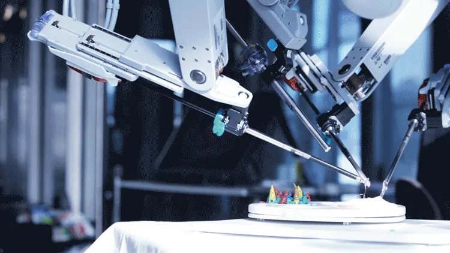

#### 🏥 [UR5 SCRUB NURSE - Robotic AI](https://ieeexplore.ieee.org/document/10765997)
`C++` `Python` `YOLO` `UrScript` `LLM`<br/>
🤖 Autonomous medical assistance robotics<br/>
📄 IEEE Official Publication
</td>
</tr>
<tr>
<td width="50%" align="center">


#### 🏭 [Industrial Automation Systems](https://jphajp.github.io/automatizacion/)
`PLC Siemens` `TIA Portal` `IoT` `SCADA`<br/>
⚙️ Industrial process automation<br/>
🎮 Deployed + Interactive Web Demo
</td>
<td width="50%" align="center">
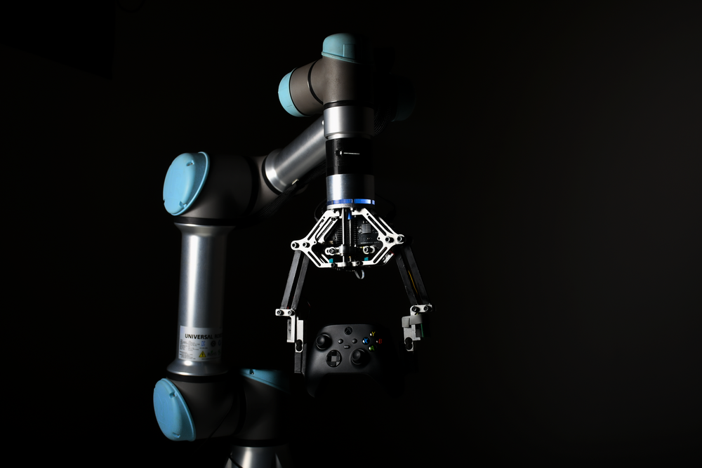
<br/>
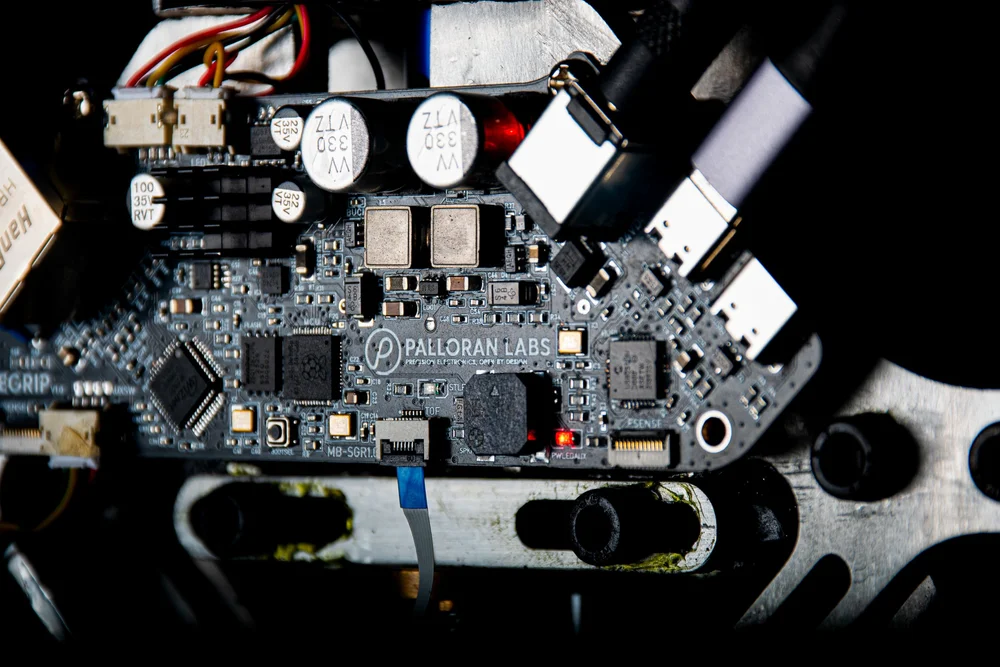
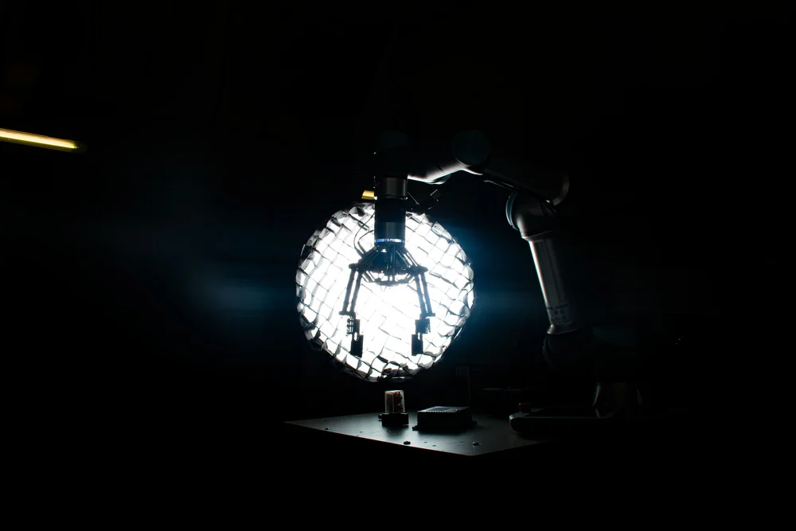
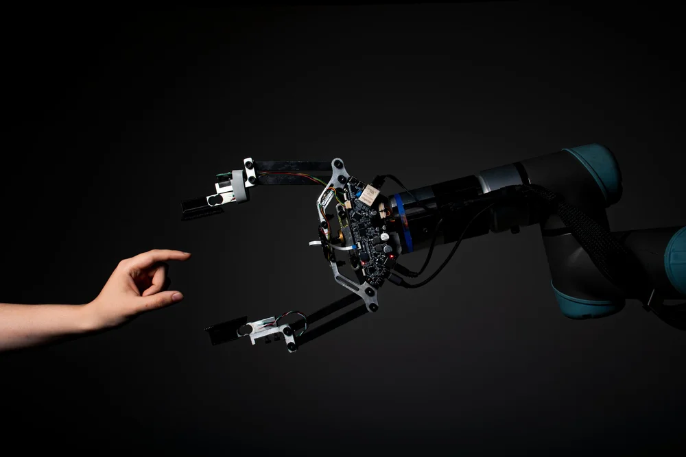

#### 🦾 [μSenseGripp - Robotic Force Control](https://www.palloranlabs.com/usensegrip)
`Python` `C` `RP2040` `Flask` `UrScript` `IoT`<br/>
🔧 Force-controlled parallel gripper<br/>
📜 Commercial
</td>
</tr>
</table>

### 🎯 **Innovation Projects**

| Preview | Project | Tech Stack | Status |
|:-------:|:--------|:-----------|:------:|
| 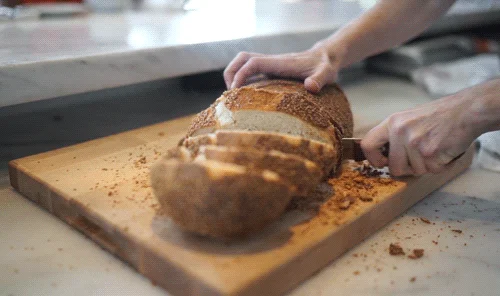 | **🍞 Smart Bakery Vision** | `YOLO` `OpenCV` `Raspberry Pi` `Firebase` | ✅ Completed |
| 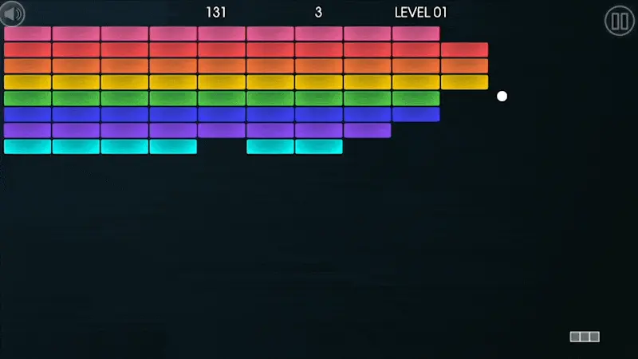 | **🎮 FPGA Atari Breakout** | `Verilog` `FPGA` `VHDL` | ✅ Demo |
| 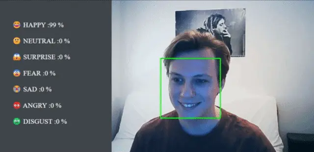 | **🧠 EmoHelper AI** | `OpenAI` `Gradio` `Llama 3.1` | ✅ Active |
|  | **🎨 StableDiffusion + UR5** | `Stable Diffusion` `Python` `UrScript` | ✅ Prototype |
|  | **📡 Digital Networks IoT** | `ESP32` `Firebase` `WebApp` | ✅ Deployed |
| 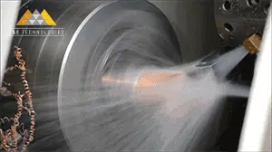 | **🔧 CNC & Lathe Control** | `PLC` `SCADA` `Industrial Control` | ✅ Industrial |
|  | **🦾 μSenseGripp** | `Python` `C` `RP2040` `Flask` `IoT` | 📜 Commercial |
| 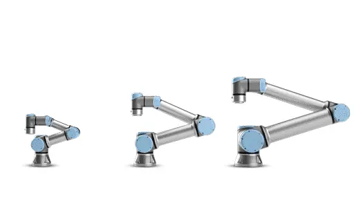 | **🤖 Gripper UR5 Control** | `ROS` `Python` `Universal Robots` | ✅ Research |
|  | **🏭 Industrial Automation Demo** | `PLC` `TIA Portal` `SCADA` | ✅ Demo |
| 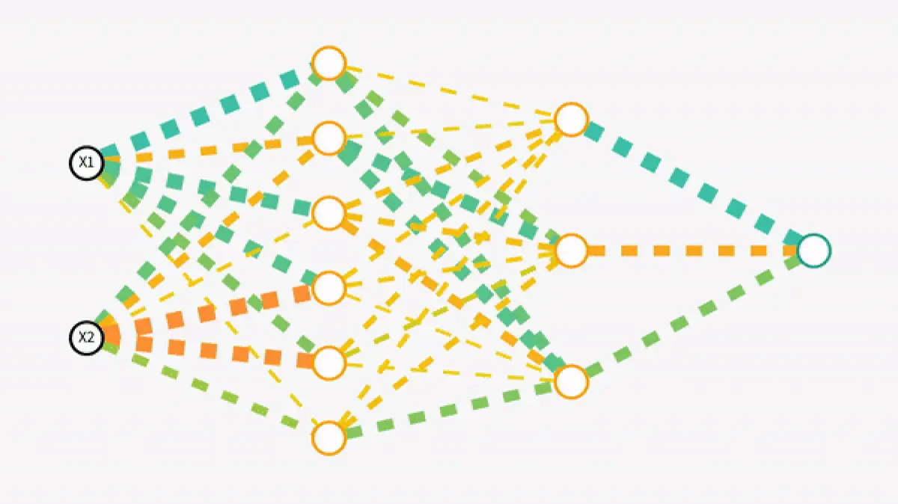 | **🧬 Neural Networks** | `Python` `ML` `Data` | ✅ Research |

</div>

## 🏅 **Achievements & Recognition**

<div align="center">

| 🏆 Achievement | 🎯 Organization | 📅 Year | 💡 Impact |
|:---------------|:----------------|:-------:|:---------|
| **🥇 Graduated with Honors** | Ibero Puebla | 2025 | 🎓 Formative excellence |
| **🥇 GPA 4.0** | Ibero Puebla | 2025 | 🎓 Perfect academic average |
| **🏅 Francisco Javier Clavijero S.J. Medal** | Ibero Puebla | 2025 | 📊 Best academic average |
| **🏅 Diego de Ledesma S.J. Medal** | Ibero Puebla | 2025 | 🤝 Human and competent formation |
| **🏅 CENEVAL Medal** | CENEVAL | 2025 | ⭐ EGEL outstanding performance |
| **🏆 ANFEI Recognition** | ANFEI | 2025 | 📊 Best graduating average in Engineering Faculty |
| **📜 CSWP Certification** | SolidWorks | 2025 | 📜 Certified SolidWorks Professional |
| **📄 IEEE Official Publication** | IEEE | 2024 | 📄 Research paper on medical robotics |
| **🚀 NASA Space Apps Challenge** | NASA | 2024 | 🚀 International innovation competition |
| **🎙️ CONITACS XIV Speaker** | CONITACS | 2024 | 🏥 National congress presentation |
| **🎓 ExpoIBERO Exhibitor** | Ibero Puebla | 2021-2025 | 🎓 Multiple university exhibitions |
| **🏭 Industrial Projects** | Various Companies | 2023-2024 | 🏭 Real-world automation deployments |

</div>

## 🎯 **Specialization Areas**

<div align="center">

<table>
<tr>
<td width="33%" align="center">

### 🤖 **Robotics**
- Universal Robots UR5
- KUKA & FANUC Systems
- ROS Navigation
- Robotic Manipulation

</td>
<td width="33%" align="center">

### 🧠 **Artificial Intelligence**
- Computer Vision YOLO
- Neural Networks
- LLM Integration
- Object Detection

</td>
<td width="33%" align="center">

### 🏭 **Industrial Automation**
- PLC Programming
- SIEMENS TIA Portal
- Industrial IoT
- SCADA Systems

</td>
</tr>
<tr>
<td width="33%" align="center">

### 💻 **Software Development**
- Python & C++ Expert
- Web Applications
- Mobile Development
- Embedded Systems

</td>
<td width="33%" align="center">

### 🎨 **Design Engineering**
- CAD 3D Modeling
- SolidWorks CSWP
- Product Design
- Rapid Prototyping

</td>
<td width="33%" align="center">

### 🌐 **IoT & Cloud**
- ESP32 & Microcontrollers
- Firebase & Databases
- Real-time Systems
- Sensor Integration

</td>
</tr>
</table>

</div>


<br/>

## 🎓 **Academic Excellence**

<div align="center">

### 🏆 **Honors & Distinctions**

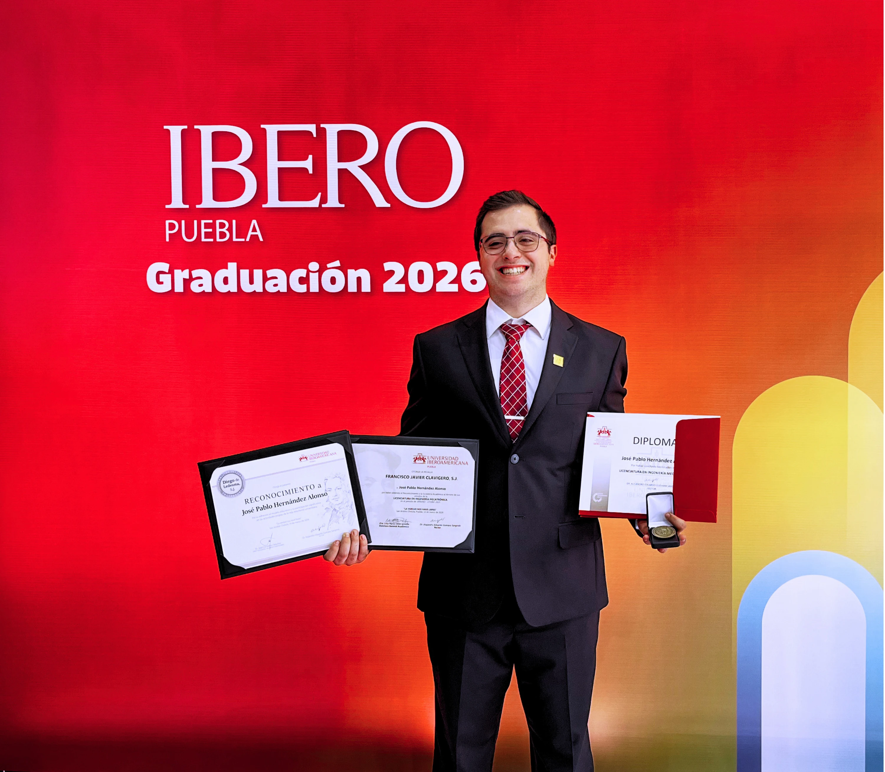

<br/><br/>

<table>
<tr>
<td align="center" width="20%">

#### 🥇 **GPA 4.0**
**Ibero Puebla**<br/>
Mechatronics Engineering<br/>
🌟 *Perfect academic average*

</td>
<td align="center" width="20%">

#### 🏅 **FRANCISCO JAVIER CLAVIJERO S.J. MEDAL**
**Ibero Puebla**<br/>
Academic Excellence<br/>
🎯 *Best academic average*

</td>
<td align="center" width="20%">

#### 🏅 **DIEGO DE LEDESMA S.J. MEDAL**
**Ibero Puebla**<br/>
Human and Competent Formation<br/>
🤝 *Integral formation recognition*

</td>
<td align="center" width="20%">

#### 🏅 **CENEVAL MEDAL**
**CENEVAL**<br/>
EGEL Certification<br/>
⭐ *Outstanding Performance*

</td>
<td align="center" width="20%">

#### 🏆 **ANFEI RECOGNITION**
**Engineering Faculty**<br/>
Graduating Class Recognition<br/>
📊 *Best graduating average in Engineering*

</td>
</tr>
</table>

### 📊 **CENEVAL EGEL Scores**

<div align="center">

#### 📈 Disciplinar Score
**1180 / 1300** - 🌟 **SOBRESALIENTE**

<div style="background-color: #0D1117; border: 2px solid #51ff9c; border-radius: 10px; padding: 10px; margin: 10px 0;">
  <div style="background: linear-gradient(90deg, #51ff9c 0%, #51ff9c 90.77%, #1a1a1a 90.77%); height: 30px; border-radius: 5px; display: flex; align-items: center; justify-content: center; font-weight: bold; color: #000;">
    90.77% EXCELLENCE
  </div>
</div>

#### 💬 Lenguaje y Comunicación Score  
**1195 / 1300** - 🌟 **SOBRESALIENTE**

<div style="background-color: #0D1117; border: 2px solid #51ff9c; border-radius: 10px; padding: 10px; margin: 10px 0;">
  <div style="background: linear-gradient(90deg, #51ff9c 0%, #51ff9c 91.92%, #1a1a1a 91.92%); height: 30px; border-radius: 5px; display: flex; align-items: center; justify-content: center; font-weight: bold; color: #000;">
    91.92% EXCELLENCE
  </div>
</div>

```ascii
╔══════════════════════════════════════════════════════════════╗
║                  CENEVAL EGEL RESULTS                        ║
║                                                              ║
║  Disciplinar:           ████████████████████░  1180/1300    ║
║  Lenguaje y Com.:       ████████████████████░  1195/1300    ║
║                                                              ║
║  Status: ✅ SOBRESALIENTE EN AMBAS ÁREAS                    ║
╚══════════════════════════════════════════════════════════════╝
```

<a href="https://git.io/typing-svg">
  
</a>

<br/>

[](https://jphajp.github.io/JPHAJP/Web/assets/docs/cenaval.pdf)

</div>

</div>

<br/>

## 📊 **System Metrics**

<div align="center">

<a href="https://github.com/JPHAJP">
  
</a>
<a href="https://github.com/JPHAJP">
  
</a>

<br/><br/>


</div>

<br/>

## 📡 **Uplink / Contact**

<div align="center">

### 💬 **Let's Collaborate on Incredible Projects!**

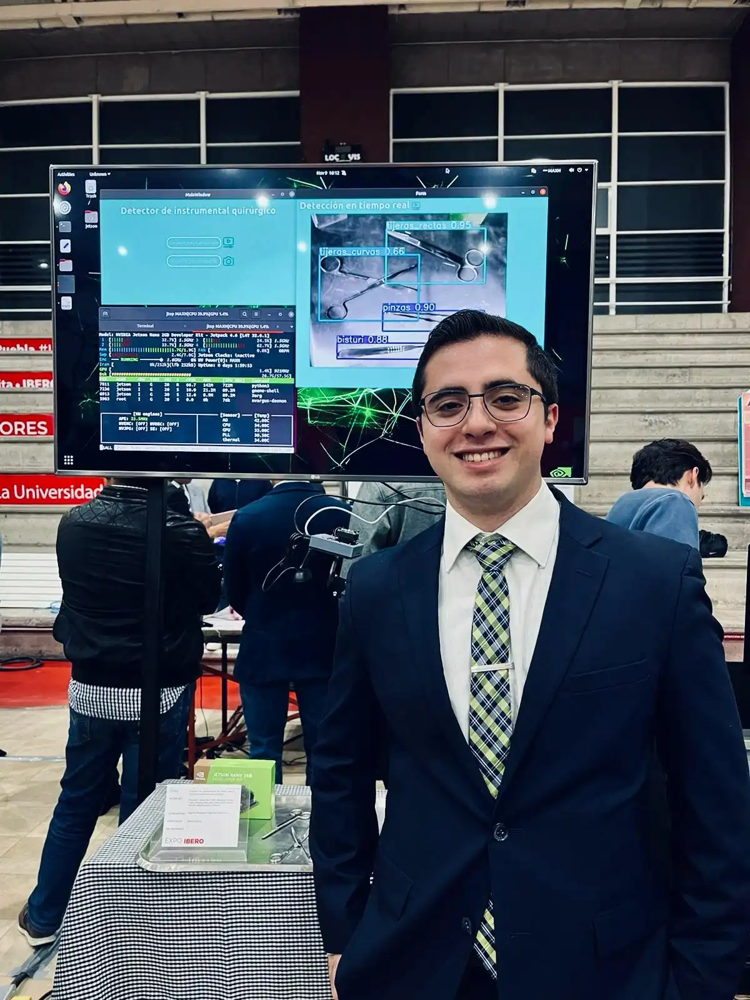

<br/><br/>

> Open to collaborations in **AI**, **Robotics**, **IoT**, and **Industrial Automation**

<br/>

| **CHANNEL** | **STATUS** | **ACTION** |
|:---:|:---:|:---:|
| **EMAIL** | `AVAILABLE` | [](mailto:contacto@jphajp.com) |
| **LINKEDIN** | `CONNECTED` | [](https://www.linkedin.com/in/jphajp/) |
| **DISCORD** | `ONLINE` | [](https://discord.com/users/jphajp) |
| **PORTFOLIO** | `DEPLOYED` | [](https://jphajp.github.io/JPHAJP/) |
| **INSTAGRAM** | `ACTIVE` | [](https://www.instagram.com/jose_pablo_ha) |
| **GITHUB** | `OPEN SOURCE` | [](https://github.com/JPHAJP) |

</div>

<br/>

## 🌟 **Core Philosophy**

<div align="center">

```ascii
╔════════════════════════════════════════════════════════════════════╗
║                                                                    ║
║     "Where Precision Engineering Meets Creative Innovation"       ║
║                                                                    ║
║  Combining technical expertise with innovative thinking to build  ║
║  solutions that transform industries and improve lives through    ║
║  the power of mechatronics, AI, and automation.                   ║
║                                                                    ║
╚════════════════════════════════════════════════════════════════════╝
```

### ⚡ **"TECH DRIVEN, HEART INSPIRED"** ⚡

</div>

<br/>

<!-- Innovative Footer -->
<div align="center">
  
  
  <p align="center">
    <sub>Crafted with passion for innovation | © 2026 José Pablo Hernández Alonso</sub>
  </p>
  
</div>
